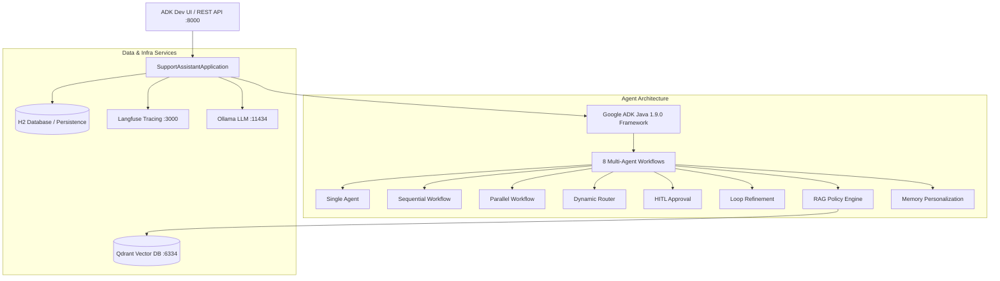

# Customer Support Investigation Assistant

[](https://openjdk.org/)
[](https://spring.io/projects/spring-boot)
[](https://github.com/google/adk-java)
[](https://qdrant.tech/)
[](https://langfuse.com/)

A production-grade Google ADK Java (1.9.0) proof-of-concept for **Northwind Retail** — an intelligent customer support assistant that investigates orders, payments, shipping, fraud alerts, policy questions, and returns using multi-agent architectures, RAG, and memory personalization.

---

## 💡 Overview & Architecture

The assistant exposes **eight demo agents** through the Google ADK Dev UI and REST APIs. It integrates local infrastructure for vector storage, observability tracing, and local LLM execution.



---

## 🚀 Quick Start

1. **Start Ollama models** (see [Prerequisites](#-prerequisites)):
   ```bash
   ollama pull qwen2.5:7b
   ollama pull nomic-embed-text
   ollama serve
   ```

2. **Launch Local Infra (Qdrant & Langfuse)**:
   ```bash
   docker compose up -d
   ```

3. **Build & Run Application**:
   ```bash
   mvn compile exec:java
   ```

4. **Access the Agent UI**:
   Open [http://localhost:8000](http://localhost:8000) and verify that all eight `demo-*` agents appear in the application dropdown.

5. **Run Manual Scenarios**:
   Follow the step-by-step test scenarios in [docs/playbook.md](docs/playbook.md).

---

## 📋 Prerequisites

| Component | Required Version | Description |
| :--- | :--- | :--- |
| **Java JDK** | `25` | Run `java -version` |
| **Apache Maven** | `3.9+` | Run `mvn -v` |
| **Google ADK Java** | `1.9.0` | Agent Development Kit (Spring Boot `4.0.2` transitive) |
| **Ollama** | Latest | Chat model (`qwen2.5:7b`) & Embeddings (`nomic-embed-text`) |
| **Docker Engine** | `20.10+` | Vector DB (Qdrant) & Telemetry (Langfuse) |

---

## 🛠️ Infrastructure & Environment

### Local Services

- **Qdrant Vector Database**: gRPC `:6334` | REST/Dashboard `:6333` (Pins: `v1.15.3` for BM25 support)
- **Langfuse Telemetry UI**: [http://localhost:3000](http://localhost:3000) (Pins: `v3.95.0`)
- **App Server**: [http://localhost:8000](http://localhost:8000)

### Telemetry / Tracing Configuration

For optional Langfuse tracing export:
1. Create a project in the Langfuse UI ([http://localhost:3000](http://localhost:3000)).
2. Export credentials via environment variables or edit `application.yml`:
   ```bash
   export LANGFUSE_PUBLIC_KEY="pk-lf-..."
   export LANGFUSE_SECRET_KEY="sk-lf-..."
   ```
*Note: The application starts cleanly without keys; telemetry spans are only exported when credentials are present.*

---

## 🤖 Demo Agent Catalog

| Agent Name | Pattern & Capability | Playbook Reference |
| :--- | :--- | :--- |
| `demo-single-agent` | Single-agent tool execution (Order & Shipping lookup) | [Playbook §1](docs/playbook.md#1-single-agent) |
| `demo-sequential-investigation` | Chained multi-agent investigation (Order &rarr; Payment &rarr; Resolution) | [Playbook §2](docs/playbook.md#2-sequential-investigation) |
| `demo-parallel-investigation` | Fan-out / Fan-in parallel multi-agent evaluation | [Playbook §3](docs/playbook.md#3-parallel-investigation) |
| `demo-dynamic-routing` | Intent classification & dynamic workflow dispatch | [Playbook §4](docs/playbook.md#4-dynamic-routing) |
| `demo-hitl-approval` | Human-in-the-loop approval gating for sensitive actions | [Playbook §5](docs/playbook.md#5-hitl-approval) |
| `demo-loop-refinement` | Iterative feedback loop & quality refinement | [Playbook §6](docs/playbook.md#6-loop-refinement) |
| `demo-rag-policy` | Qdrant hybrid vector search for Northwind policy retrieval | [Playbook §7](docs/playbook.md#7-rag-policy) |
| `demo-memory-personalization` | Long-term preference recall and customer state binding | [Playbook §8](docs/playbook.md#8-memory-personalization) |

---

## 🔄 LLM Provider Switching

Switching LLM providers requires zero code changes. Update `llm.provider` in `application.yml` or set environment variables:

- **Ollama** (Default local): `llm.provider=ollama`
- **Google Gemini**: `llm.provider=gemini` (`GEMINI_API_KEY`)
- **Anthropic**: `llm.provider=anthropic` (`ANTHROPIC_API_KEY`)
- **OpenRouter**: `llm.provider=openrouter` (`OPENROUTER_API_KEY`)

---

## 🧪 Evaluation Harness (Layers 0–3)

Evaluate agent accuracy, prompt safety, and tool execution without subjective LLM-as-judge overhead:

```bash
# Layer 0 — Tool logic & Guardrails (No LLM required)
mvn test -Dtest=ToolEvalTest,GuardrailEvalTest

# Layer 1 — Policy Retrieval (Qdrant vector search, no chat LLM)
mvn test -Dtest=RetrievalEvalTest

# Layer 2 — Prompt & Determinism (Ollama @ temp 0)
mvn test -Dtest=PromptEvalTest

# Layer 3 — End-to-end multi-agent evaluation harness
mvn test -Dtest=EvaluationHarnessTest
```

*Note: Running `mvn test` directly executes Layers 0–1 and individual Layer 3 evaluation tests cleanly.*

---

## 👥 AI Agent & Developer Guidelines

This repository strictly adheres to **Andrej Karpathy's Coding Guidelines** and the **Agent Skills Lifecycle**:

- **[AGENTS.md](AGENTS.md)**: Repository guidelines (Think Before Coding, Simplicity First, Surgical Changes, Goal-Driven Execution).
- **[.agents/](.agents/)**: Self-contained skills (`.agents/skills/`), specialist subagents (`.agents/agents/`), and workflow rules (`.agents/rules/`).

---

## 📚 Documentation Links

- **Requirements & Specification**: [docs/spec.md](docs/spec.md)
- **Manual Test Scenarios (Playbook)**: [docs/playbook.md](docs/playbook.md)
- **Task & Implementation Plan**: [tasks/plan.md](tasks/plan.md)
- **Agent Rules & Guidelines**: [AGENTS.md](AGENTS.md)
