# Architecture: Customer Support Investigation Assistant

Status: **APPROVED**

This document describes *how* the system in `spec.md` is built: process topology, package/class structure, data schemas, and the runtime path each Playbook scenario takes. It does not restate product requirements, seed data, or acceptance criteria — see `spec.md` and `playbook.md` for those. Diagram IDs (`D0`–`D12`) match the table in `playbook.md` exactly so Playbook scenarios can cross-reference them.

Diagrams use short labels; the surrounding prose holds the detail. Every ADK/Qdrant/Langfuse API fact below was verified against current official sources before being written down (per `spec.md` → Boundaries → Always). Citations are consolidated in [References](#references).

**Stack lock:** the app stays local (no GCP/AWS deploy). Embeddings, guardrails, observability, and vector search stay on the local stack. Hybrid retrieval is **BM25 + semantic dense**, fused with RRF — not two semantic models. Vertex AI Vector Search was considered and rejected (see [§8](#8-key-architecture-decisions)).

---

## 1. System Context — D0

Single JVM process. `SupportAssistantApplication` is the only `@SpringBootApplication`; it hosts both our code and ADK's Dev UI/REST server in one Spring context (`scanBasePackages = {"com.poc.adk", "com.google.adk.web"}` — no `AdkWebServer.start(...)` call [[1]](#references)).

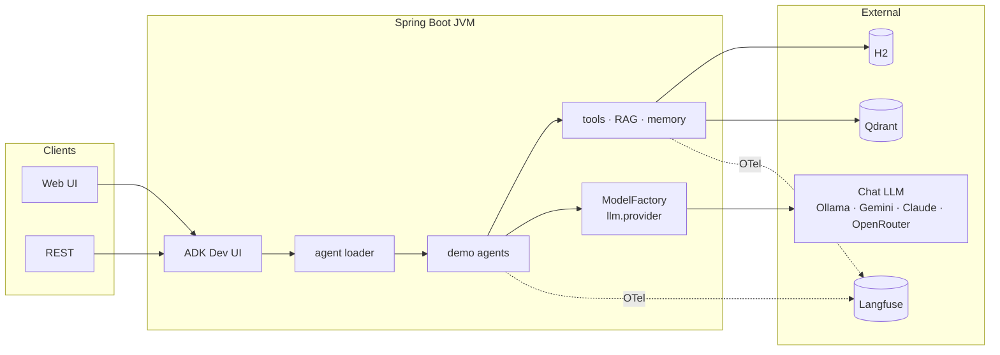

- REST surface: `/run`, `/run_sse`. Agent discovery: `SpringAgentLoader` (`adk.agents.loader: spring`) registers Spring-managed `BaseAgent` beans from `AgentBeansConfig`.
- H2 file DB at `./data/support-assistant`. Qdrant and Langfuse run in Docker (`:6334` gRPC, `:3000` UI).
- `ModelFactory` reads `llm.provider` and returns one ADK `BaseLlm` — agents never hard-code a vendor. Switching `ollama` → `gemini` is config-only (see [§5](#5-model-routing--d11)).
- Dense embeddings (`nomic-embed-text`) go through `EmbeddingClient` → Ollama directly, not through `ModelFactory`.

---

## 2. Process Architecture

### 2.1 Boot sequence

1. `main()` → `SpringApplication.run` starts our context.
2. Our `@Configuration` classes build: JPA/H2, `QdrantClient` (gRPC, `:6334`), the `OpenTelemetrySdk` (OTLP/HTTP exporter → Langfuse), and `ModelFactory`.
3. During context refresh (not an `ApplicationRunner`), `@Bean` methods populate `LlmContext` / `TracingContext` / `VectorContext` and construct one Spring bean per function tool (each with only its repository). Hibernate `ddl-auto=create-drop` creates H2 tables from JPA entities (mapped 1:1 to `schema.sql`); business rows come from `data.sql` only. After RAG exists, a separate `PolicyChunkIndexer` `ApplicationRunner` embeds policy markdown into Qdrant if the collection is empty — it must never `save()` / `INSERT` Northwind tables.
4. `AdkWebServer`'s own auto-configuration registers its beans (`sessionService`, `artifactService`, `memoryService`, `objectMapper`, `mappingJackson2HttpMessageConverter` — all `InMemory*` by default) [[2]](#references).
5. `SpringAgentLoader` (`@Service("agentLoader")`, `@Primary`, selected via `adk.agents.loader: spring`) collects all Spring `BaseAgent` beans from `AgentBeansConfig` and registers one entry per `demo-*` agent in the Web UI dropdown. Each agent factory receives wired tool beans and `GuardrailAuditService`, binding tools with `FunctionTool.create(bean, methodName)`.

Step 3 must complete before step 5 can serve a request: agent graphs are Spring beans built after their tool and LLM dependencies exist. Chat/OTel/Qdrant still use module-scoped static bridges (`LlmContext`, `TracingContext`, `VectorContext`) for callers that are not Spring-managed. Each tool is its own Spring bean and receives only the repository it needs (`OrderLookupTool(OrderRepository)`, not a shared `ToolDependencies` bag). Tool methods are **instance** methods on those beans.

### 2.2 Bean-name collision — resolved

`AdkWebServer` declares `@Bean public BaseSessionService sessionService()`, `@Bean public BaseArtifactService artifactService()`, and `@Bean public BaseMemoryService memoryService()`, all returning `InMemory*` implementations [[2]](#references). `OpenTelemetryConfig` (1.9.0) declares `@Bean OpenTelemetry openTelemetrySdk(...)` plus `sdkTracerProvider`, `apiServerSpanExporter`, and `apiServerSpanExporterConfig`. Spring Boot rejects a second bean definition with the same name by default, so `com.poc.adk` **must not** declare beans named `sessionService`, `artifactService`, `memoryService`, `objectMapper`, `mappingJackson2HttpMessageConverter`, `openTelemetrySdk`, `sdkTracerProvider`, `apiServerSpanExporter`, or `apiServerSpanExporterConfig` (already stated as a boundary in `spec.md`). Langfuse export uses a separately named `langfuseOpenTelemetrySdk` bean.

**Consequence for memory architecture:** our H2-backed long-term memory and Qdrant-backed semantic memory are **not** wired through ADK's `BaseMemoryService` SPI — that stays the default `InMemoryMemoryService`, unused by our agents. Instead, `memory-services` is a package of plain Java services invoked as **function tools** (`CustomerPreferenceTool`), constructed as its own Spring bean with `CustomerPreferenceRepository` (the preference repository lives with the customer aggregate), exactly as the Capability Map models them (tools, not a memory-service override). Short-term memory runs on ADK's default `InMemorySessionService` — acceptable per `spec.md` (single-instance POC; short-term memory is not required to survive a restart).

### 2.3 HITL `FunctionResponse` shape — resolved

Per ADK's confirmation contract [[4]](#references), resuming a paused tool call requires a `FunctionResponse` matching this shape exactly:

```json
{
  "id": "<function_call_id of the adk_request_confirmation FunctionCall>",
  "name": "adk_request_confirmation",
  "response": {
    "confirmed": true,
    "payload": {}
  }
}
```

`id` must equal the `function_call_id` on the `adk_request_confirmation` event ADK emitted — not the ID of the original tool call being confirmed. The Web UI's approval dialog sends this shape over `/run_sse`; Layer-3 JUnit tests construct it directly against `InMemoryRunner`. See [D5](#65-human-in-the-loop--d5) for the runtime path.

### 2.4 Embedding dimension — resolved

`nomic-embed-text` (Ollama) is documented at **768 dimensions** [[5]](#references). The `policy_chunks` collection uses `size=768, distance=Cosine` for the dense vector. `EmbeddingClient` asserts `vector.length == 768` on its first call at startup and fails fast on mismatch, replacing the ad hoc `curl` check.

---

## 3. Package Structure

Extends `spec.md`'s indicative layout with concrete class names; each class maps to a Capability Map module. JPA types are **re-packaged by subdomain** (entity + repository co-located) — not a flat `domain/` plus a separate `repository/` tree. `@SpringBootApplication` on `com.poc.adk` is enough for entity and Spring Data scans; no extra `@EntityScan`.


```
src/main/java/com/poc/adk/
  SupportAssistantApplication.java
  commerce/
    customer/     Customer.java, CustomerPreference.java,
                  CustomerRepository.java, CustomerPreferenceRepository.java
    order/        Order.java, OrderRepository.java
    payment/      Payment.java, PaymentRepository.java
    shipment/     Shipment.java, ShipmentRepository.java
  support/
    ticket/       Ticket.java, TicketRepository.java
  risk/
    fraud/        FraudSignal.java, FraudSignalRepository.java
  platform/
    audit/        GuardrailAuditLog.java, GuardrailAuditLogRepository.java
    evaluation/   EvaluationRun.java, EvaluationRunRepository.java
  config/                         // Spring @Configuration / @ConfigurationProperties only
    ModelRoutingProperties.java   // @ConfigurationProperties("llm")
    ModelFactory.java             // builds the ADK BaseLlm from llm.provider
    ObservabilityConfig.java      // OpenTelemetrySdk + OTLP exporter bean
    QdrantConfig.java             // QdrantClient bean + collection bootstrap (idempotent)
  integration/
    adk/                          // SpringAgentLoader + static bridges for chat/OTel/Qdrant
      SpringAgentLoader.java      // AgentLoader over Spring BaseAgent beans
      LlmContext.java             // ModelFactory + BaseLlm
      TracingContext.java         // Tracer / OTel helpers
      VectorContext.java          // QdrantClient (Task 11)
    config/                       // @Bean methods during context refresh
      ToolIntegrationConfig.java  // one @Bean per tool; each tool holds only its repo
      LlmIntegrationConfig.java
      ObservabilityIntegrationConfig.java
  agents/
    config/AgentBeansConfig.java  // one @Bean per demo-* agent graph
    singleagent/, sequential/, parallel/, routing/, hitl/, loop/, rag/, personalization/
      // one factory class per demo-*; Spring beans created in AgentBeansConfig
  tools/
    OrderLookupTool.java, PaymentHistoryTool.java, ShipmentTrackingTool.java, FraudSignalTool.java
    RefundTool.java               // HITL threshold check inside the method body — see 2.3 / D5
  memory/
    CustomerPreferenceTool.java   // long-term — reads customer_id from session.state
  guardrails/
    InputGuardrailCallback.java   // BeforeModelCallback
    OutputGuardrailCallback.java  // AfterModelCallback
    PiiMasker.java, PromptInjectionHeuristics.java, GuardrailAuditService.java
  rag/
    ChunkingService.java          // ## / ### header split, ~400-token cap, ~50-token overlap on size-splits
    EmbeddingClient.java          // Ollama /api/embeddings HTTP, asserts 768-dim
    HybridRetriever.java          // dense prefetch + BM25 prefetch + RRF in one queryAsync
    CitationFormatter.java
    PolicyChunkIndexer.java       // ApplicationRunner — indexes policy markdown; does not INSERT H2 rows
src/main/resources/
  policies/{refund,shipping,fraud,loyalty}-policy.md
  prompts/{agent}.v1.md
src/test/resources/eval/*.eval.json
docker-compose.yml                // Qdrant (>= 1.15.2) + Langfuse (repo root)
data/                             // H2 file-mode DB, gitignored
```

No client-side BM25 tokenizer. Qdrant generates sparse BM25 vectors from raw text (`model = "qdrant/bm25"`) [[15]](#references).

---

## 4. Data Architecture

### 4.1 H2 schema

Column/FK contract: `[src/main/resources/schema.sql](../src/main/resources/schema.sql)`. Runtime DDL is Hibernate `create-drop` from the JPA entities that match that file. Seed: `[src/main/resources/data.sql](../src/main/resources/data.sql)`. Column types, FKs, and allowed-value CHECKs live only in `schema.sql` — do not duplicate them as Java enums. `GUARDRAIL_AUDIT_LOG` and `EVALUATION_RUN` are standalone logs (no FK); seed leaves both empty. `ORD-9999` is never seeded.

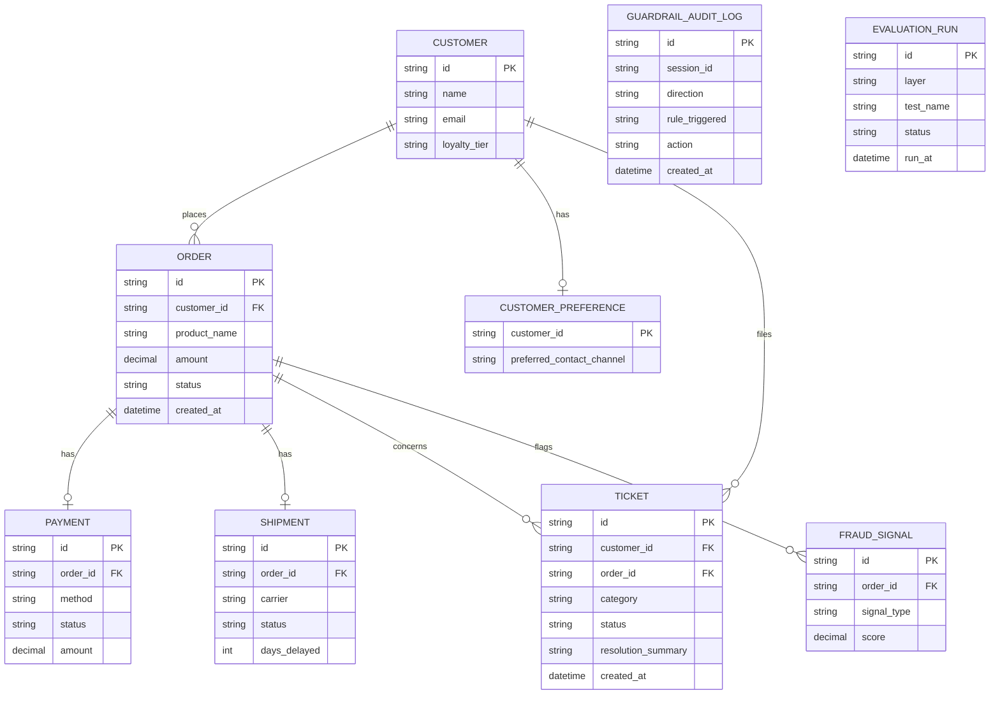


### 4.2 Qdrant collections

See [rag-and-qdrant.md](rag-and-qdrant.md) for a full walkthrough of chunking, indexing, dense/BM25/hybrid search, and the Java client. Summary below.

One collection. Semantic memory in this POC **is** that collection — the four policy files are the facts / business rules (Playbook §7). There is no second Qdrant corpus and no `semantic_memory` collection. Playbook §8 (customer preferences) is H2 by `customer_id` from `session.state`, not vector similarity.


| Collection      | Vectors                                                                                             | Payload                                                                 | Purpose                                                                                                 |
| --------------- | --------------------------------------------------------------------------------------------------- | ----------------------------------------------------------------------- | ------------------------------------------------------------------------------------------------------- |
| `policy_chunks` | `dense`: 768-dim Cosine (`nomic-embed-text`). `lexical`: sparse BM25 (`qdrant/bm25` + IDF modifier) | `doc_id`, `source_path`, `section_heading`, `chunk_index`, `chunk_text` | RAG + citations ([D7](#67-rag-policy-qa--d7)); semantic-memory demo ([D8](#68-memory-architecture--d8)) |


### 4.3 Hybrid search — BM25 + semantic

Hybrid means **two ranked lists, then fusion** — not "the agent read two documents," and not two semantic models.


| Retriever    | Qdrant vector                | What it ranks         | Playbook job                    |
| ------------ | ---------------------------- | --------------------- | ------------------------------- |
| **Semantic** | named `dense` (768-d cosine) | paraphrases / meaning | "how long can I send this back" |
| **BM25**     | named `lexical` (sparse)     | exact tokens / codes  | `NW-SHIP-EXC-04`, `NW-HP-1001`  |


"Sparse" is the storage form of BM25 (one dimension per vocabulary term, most zeros). It is **not** SPLADE or a second embedding model.

**Why not a payload full-text index?** That index is a **filter**. Filters do not produce a relevance score or a ranked list, so they cannot feed RRF: "a filter does not contribute to the ranking of search results, as no score is calculated for filters" [[6]](#references). `spec.md` pre-authorized upgrading the lexical side to a named sparse BM25 vector; that upgrade is required, not optional.

**How BM25 vectors are produced:** pin Qdrant **≥ 1.15.2** and send raw chunk/query text with `model = "qdrant/bm25"`. Qdrant tokenizes, builds the sparse vector, and applies collection-level IDF (`modifier: idf`). No Java tokenizer [[15]](#references).

**How RRF works:** each retriever returns an ordered list. Fusion uses **rank**, not raw cosine vs BM25 (those scales do not mix):

`score(chunk) = 1/(k + rank_dense) + 1/(k + rank_bm25)` with `k = 60`.

A chunk that is weak on meaning but #1 on the exception code still rises. That is the Playbook §7.3 trap: dense-only prefers shipping-policy weather prose; hybrid prefers the loyalty courtesy clause.

Both prefetches and RRF run in **one** `queryAsync` [[7]](#references):

```java
client.queryAsync(QueryPoints.newBuilder()
    .setCollectionName("policy_chunks")
    .addPrefetch(PrefetchQuery.newBuilder()
        .setQuery(nearest(denseEmbedding)).setUsing("dense").setLimit(20))
    .addPrefetch(PrefetchQuery.newBuilder()
        .setQuery(nearest(Document.newBuilder()
            .setText(query).setModel("qdrant/bm25").build()))
        .setUsing("lexical").setLimit(20))
    .setQuery(rrf(Rrf.newBuilder().setK(60).build()))
    .setLimit(10)
    .build());
```

---

## 5. Model Routing — D11

`Gemini` and `Claude` extend `com.google.adk.models.BaseLlm` [[8]](#references). ADK **1.9.0** has no `OpenAiCompatibleLlm` yet (PR [#1202](https://github.com/google/adk-java/pull/1202) still open); Ollama/OpenRouter use a thin local `ChatCompletionsLlm` over ADK's `ChatCompletionsHttpClient`. `ModelFactory.create(ModelRoutingProperties)` switches on `llm.provider` and returns a `BaseLlm`, so no agent code changes when the provider changes.

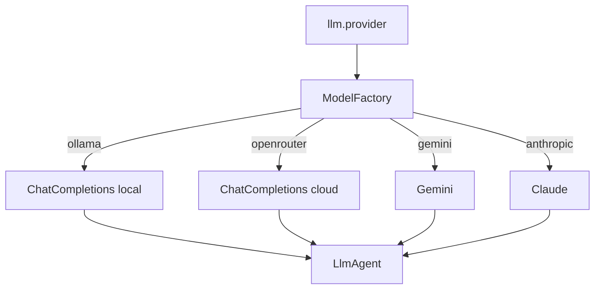

- Ollama: `ChatCompletionsLlm` at `http://localhost:11434/v1/`, model `qwen2.5:7b`.
- OpenRouter: same class, `openrouter.ai/api/v1/`, `Authorization` header.
- Gemini: `Gemini.builder().modelName(...).apiKey(...).build()`. Anthropic: `new Claude(modelName, AnthropicOkHttpClient.builder().apiKey(...).build())`. Confirmed against `google-adk` **1.9.0** source (`spec.md` → Boundaries → Always).

---


## 6. Per-Agent Runtime Paths

Guardrails (D9) and OTel (D10) wrap every path below; they are omitted from these diagrams so the agent graph stays readable.

### 6.1 Single Agent + Tool Call — D1

Playbook §1. Short-term memory is `session.state` on ADK's default `InMemorySessionService` ([§2.2](#22-bean-name-collision--resolved)): turn 2 ("Who is it for?") should not repeat `order_lookup`.

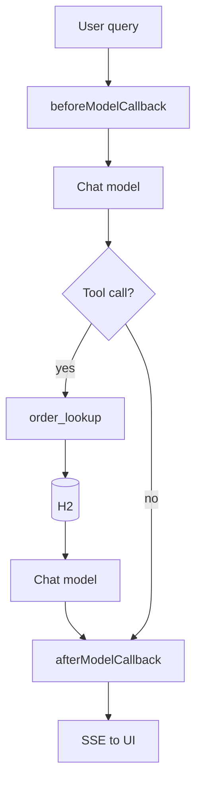


### 6.2 Sequential Workflow — D2

`SequentialAgent` never transfers control back to a parent `LlmAgent` [[9]](#references), so it is the registered root agent bean. Sub-agents chain via `outputKey` → `{key}` placeholders. Missing order `ORD-9999`: `order_lookup` returns empty; gather still completes; draft reports not found.

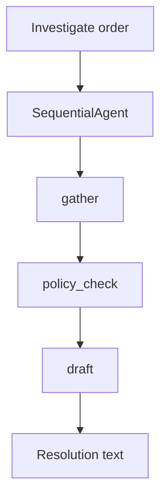


- `gather` writes `investigation_facts` (order / payment / shipment tools).
- `policy_check` reads that key, runs RAG, writes `policy_findings`.
- `draft` reads both keys.


### 6.3 Parallel Workflow — D3

`ParallelAgent` also never transfers back to a parent `LlmAgent` [[9]](#references). Fan-out and aggregator are siblings inside a `SequentialAgent` root. Langfuse spans for the three checks must overlap in time.

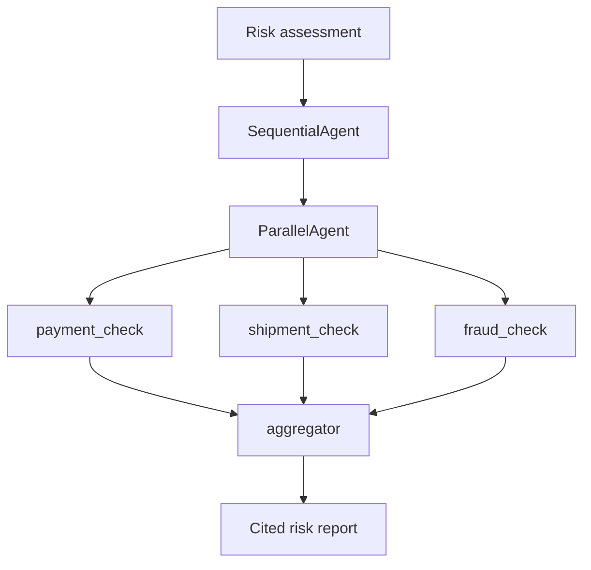


`outputKey`s: `payment_status`, `shipment_status`, `fraud_signal`. Seeded fraud on `ORD-5002`: `MULTIPLE_SHIPPING_ADDRESSES`, score `0.82`.

### 6.4 Dynamic Routing — D4

The coordinator's model emits `transfer_to_agent(agent_name=...)`; ADK's `AutoFlow` intercepts it and resolves the target via `root_agent.findAgent(...)` [[10]](#references) — no explicit `AgentTool` wrapping.

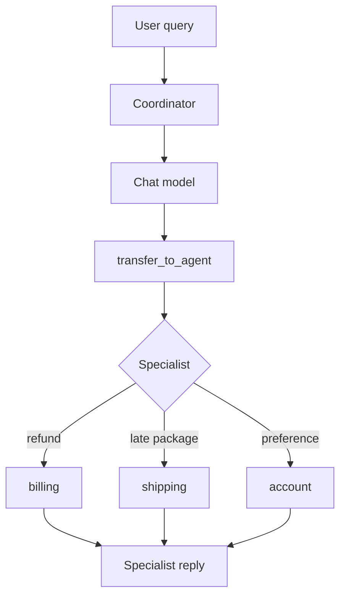


### 6.5 Human-in-the-Loop — D5

Threshold logic lives inside the tool body (data-dependent $200), not a static `FunctionTool.create(..., true)` flag — ADK's documented dynamic-threshold pattern [[11]](#references). Wire format: [§2.3](#23-hitl-functionresponse-shape--resolved). Reject (`confirmed: false`) must not write H2.

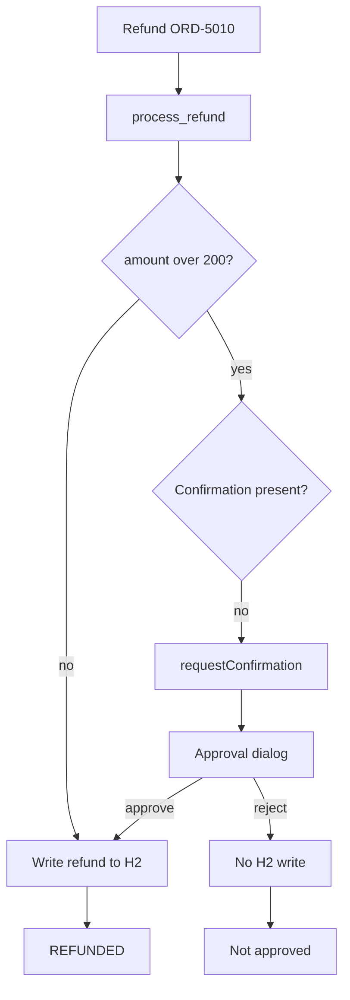


### 6.6 Loop Agent Refinement — D6

`LoopAgent` never transfers back to a parent `LlmAgent` [[9]](#references). A publisher sibling inside a `SequentialAgent` root reads the loop's final `{draft}`. The critic exits by setting `EventActions.escalate = true` (or the built-in `exit_loop` tool) [[12]](#references). `maxIterations = 3` is the hard cap; publisher still emits a best-effort draft if the cap is hit.

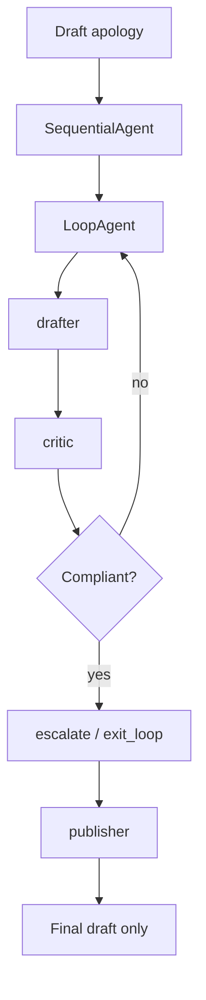

### 6.7 RAG Policy Q&A — D7

Dense-only would rank shipping-policy weather #1 (semantic distractor). BM25 hits the exact codes in `loyalty-policy.md`; RRF promotes that chunk. Citations come from payload (`source_path` + `section_heading`), not from the model guessing.

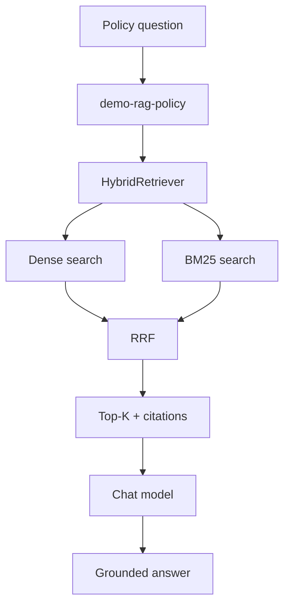

### 6.8 Memory Architecture — D8

Episodic memory is **descoped** — no ticket-history memory tool. `Ticket` rows may exist as domain data; they are not a memory demo.

### Comparison matrix (Northwind)


| Memory type    | Northwind example                             | Store                        | Access in this POC                           |
| -------------- | --------------------------------------------- | ---------------------------- | -------------------------------------------- |
| **Short-term** | "Who is it for?" → `ORD-5001` from prior turn | ADK `InMemorySessionService` | `session.state` + conversation — Playbook §1 |
| **Long-term**  | Contact preference **email** (stable trait)   | H2 `CustomerPreference`      | `CustomerPreferenceTool` — Playbook §8       |
| **Semantic**   | Refund window from policy docs                | Qdrant `policy_chunks`       | `HybridRetriever` — Playbook §7              |


### Session identity (`customer_id`)

Long-term personalization binds **one customer per session** via initial `session.state`:


| Step            | Action                                                                          |
| --------------- | ------------------------------------------------------------------------------- |
| Create session  | Set `{"customer_id": "CUST-1001"}` (or `CUST-1002`) in initial state            |
| Run query       | User message does **not** include customer id — Playbook §8                     |
| Tool path       | `CustomerPreferenceTool` reads `customer_id` from `ToolContext` / session state |
| Change customer | **New session** with a different `customer_id`                                  |


Exact REST path (ADK **1.9.0** `SessionController`): see `tasks/plan.md` → Spike findings.

```bash
curl -s -X POST "http://localhost:8000/apps/demo-memory-personalization/users/user/sessions" \
  -H "Content-Type: application/json" \
  -d '{"state": {"customer_id": "CUST-1001"}}'
```

Use `userId` `user` (ADK Dev UI default). Curl-created sessions must be opened from the Dev UI session list — **New session** creates a separate session with no `customer_id` (see [Playbook §8](playbook.md#session-identity-playbook-8)).

Layer 3: `InMemoryRunner` sets the same initial state. Dev UI can set state via **Update state** (`stateDelta` on next run); `bind_customer` is not required.

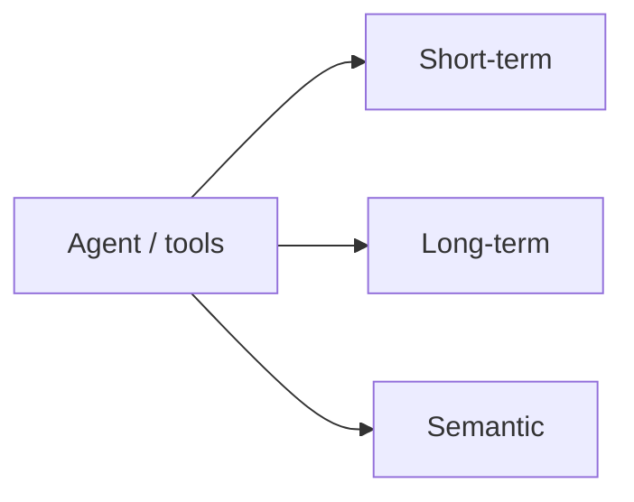


| Type       | Store                        | Contents                     | Access                                                      |
| ---------- | ---------------------------- | ---------------------------- | ----------------------------------------------------------- |
| Short-term | ADK `InMemorySessionService` | Conversation turns           | `session.state`                                             |
| Long-term  | H2 `CustomerPreference`      | `preferred_contact_channel`  | `CustomerPreferenceTool` (`customer_id` from session state) |
| Semantic   | Qdrant `policy_chunks`       | Policy text (business rules) | `HybridRetriever`                                           |


---


## 7. Cross-Cutting Pipelines


### 7.1 Guardrails — D9

Implemented as ADK `LlmAgent` callbacks [[13]](#references): `beforeModelCallback` returning a non-empty `LlmResponse` **skips** the model call (input short-circuit); `afterModelCallback` can **replace** the `LlmResponse` (output masking). Applied uniformly via a shared builder helper — no agent is exempt.

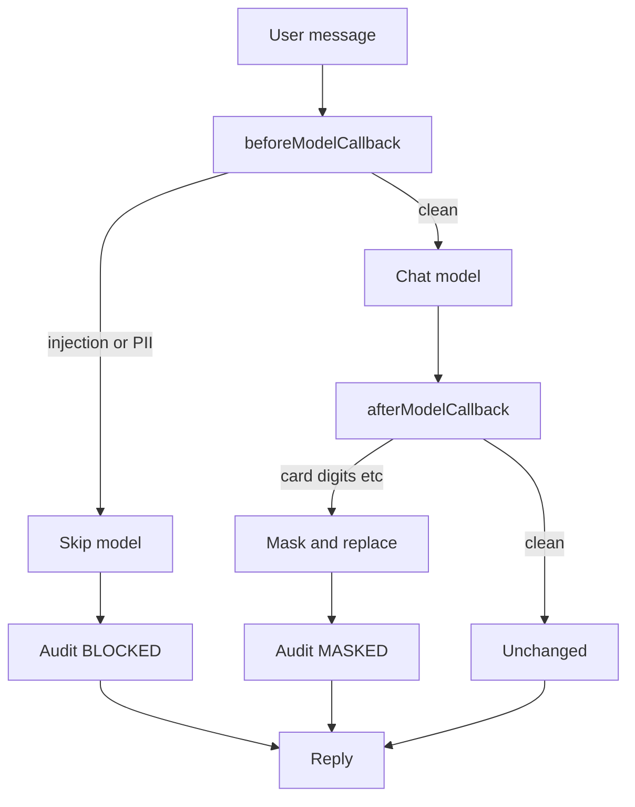


Tool callbacks (`beforeToolCallback` / `afterToolCallback`) wrap tool execution the same way; they are logging/audit hooks in this POC, not a second safety model. Hallucination mitigation is RAG grounding + Playbook §7.4, not an LLM-as-judge.

### 7.2 Observability — D10

Langfuse's OTLP endpoint requires HTTP (protobuf or JSON) — gRPC is not supported — and self-hosted Langfuse must be ≥ v3.22.0 [[14]](#references). Root `docker-compose.yml` pins a compatible image.

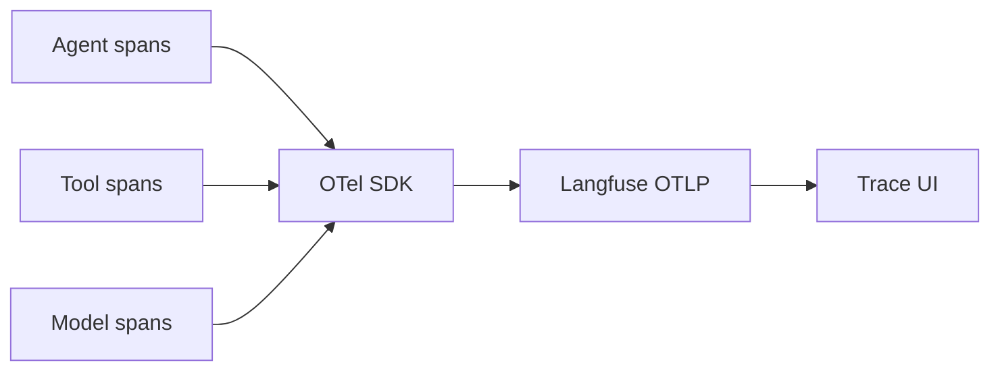


Export: OTLP/HTTP protobuf to `/api/public/otel`, Basic Auth, header `x-langfuse-ingestion-version: 4`. Trace UI shows token usage, latency, cost, errors.

### 7.3 Evaluation Harness — D12

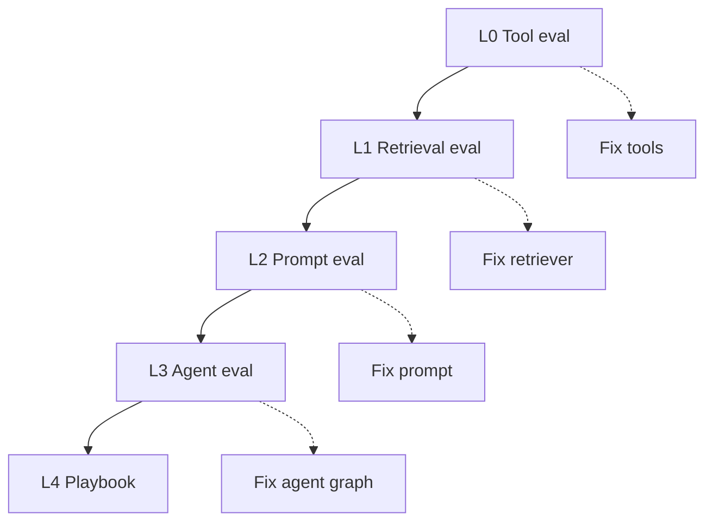

L0–L1: no LLM. L2–L3: LLM, temperature 0. L4: manual Web UI. Localize the failing layer before editing a prompt.

---

## 8. Key Architecture Decisions


| #   | Decision                                                                                                                                                            | Rationale                                                                                                                                                            |
| --- | ------------------------------------------------------------------------------------------------------------------------------------------------------------------- | -------------------------------------------------------------------------------------------------------------------------------------------------------------------- |
| 1   | Hybrid = **BM25 sparse + nomic dense**, fused with RRF. Lexical side is a named sparse vector, not a payload full-text filter                                       | Filters have no rank, so they cannot feed RRF [[6]](#references). Sparse is BM25 storage, not a second semantic model. See [§4.3](#43-hybrid-search--bm25--semantic) |
| 2   | Qdrant **≥ 1.15.2** generates BM25 from raw text (`qdrant/bm25`). No Java `SparseVectorizer`                                                                        | Official Java `Document` inference [[15]](#references); fewer moving parts than a client tokenizer                                                                   |
| 3   | Stay on **local** Qdrant. Do not use Vertex AI Vector Search (or other cloud vector DBs)                                                                            | Same hybrid algorithm, extra GCP index/endpoint/IAM/always-on replicas. Does not simplify the Playbook retrieval test                                                |
| 4   | Embeddings, guardrails, and observability stay local (Ollama `nomic-embed-text`, ADK callbacks, OTel → Langfuse). App is not deployed to GCP/AWS                    | Cloud services here add credentials and network without teaching more ADK. Langfuse is a named POC topic                                                             |
| 5   | `ParallelAgent` / `LoopAgent` / `SequentialAgent` are each wrapped in (or are) a `SequentialAgent` root, with follow-up `LlmAgent`s as siblings reading `outputKey` | These workflow agents never hand control back to a parent `LlmAgent` [[9]](#references)                                                                              |
| 6   | Long-term memory is a tool over H2 (`CustomerPreferenceTool`), not `BaseMemoryService`. Semantic memory is RAG over `policy_chunks`. Episodic descoped              | `AdkWebServer` hard-codes `InMemoryMemoryService`; overriding the bean name collides — see [§2.2](#22-bean-name-collision--resolved)                                 |
| 7   | Demo agents are Spring `@Bean`s (`AgentBeansConfig`) loaded by `SpringAgentLoader`; tools are instance-bound via `FunctionTool.create(bean, method)`. Chat/OTel/Qdrant still use `integration/adk` static bridges | Avoids constructor-escape static tool singletons and race with reflective `ROOT_AGENT` loading. Bridges remain only for non-Spring callers (`LlmContext` / tracing / Qdrant) |
| 8   | Dynamic routing uses `subAgents()` + implicit `transfer_to_agent`, not explicit `AgentTool` wrapping                                                                | Coordinator/Specialist with the least code [[10]](#references)                                                                                                       |
| 9   | HITL threshold check lives inside the tool method body, not a static `requireConfirmation` flag                                                                     | $200 threshold is data-dependent [[11]](#references)                                                                                                                 |
| 10  | Semantic memory = `policy_chunks` only. No second Qdrant collection                                                                                                 | Spec/playbook never define a separate fact corpus. Policy files already are the business rules; §8 long-term memory is H2 preferences                                |


---

## 9. Non-Goals / Carried Forward to Plan

Exact Qdrant image tag (≥ 1.15.2), Maven dependency versions, and prompt file contents are Plan-phase, not Architecture. No open product or schema questions remain.

---

## References

1. Spring Boot `spring-projects/spring-boot#39943` — scanning `AdkWebServer`'s package instead of calling `AdkWebServer.start()`.
2. `AdkWebServer` API reference (`adk.dev/api-reference/java/com/google/adk/web/AdkWebServer.html`) — `sessionService()`, `artifactService()`, `memoryService()` bean methods; `google/adk-java#588`.
3. `AgentLoader` SPI / ADK web agent loading (`adk.dev` — `SpringAgentLoader` in this repo replaces reflective `CompiledAgentLoader` when `adk.agents.loader=spring`).
4. `adk.dev/tools-custom/confirmation/` — Action confirmations, `FunctionResponse` shape for `adk_request_confirmation`.
5. Ollama `nomic-embed-text` model card / Nomic documentation (`docs.nomic.ai/atlas/embeddings-and-retrieval/text-embedding`) — 768 dimensions.
6. Qdrant `documentation/search/text-search/` and `text-search/full-text-search/` — filters vs. queries, BM25 via sparse vectors.
7. Qdrant `documentation/search/hybrid-queries/` and `QueryFactory` API (`qdrant.github.io/java-client`) — `PrefetchQuery` + `rrf(Rrf)`.
8. `adk.dev/api-reference/java/com/google/adk/models/` — `BaseLlm`, `ChatCompletionsHttpClient`, `Claude`, `Gemini`. `OpenAiCompatibleLlm` is not in 1.9.0 (`google/adk-java#1202`).
9. `SequentialAgent`, `ParallelAgent`, `LoopAgent` API references (`adk.dev/api-reference/java/com/google/adk/agents/`) — composition rules, `outputKey`/`{key}` chaining.
10. `google/adk-docs` — `docs/agents/multi-agents.md` — `transfer_to_agent`, `AutoFlow`, `find_agent`.
11. `google/adk-docs` — `docs/tools-custom/confirmation.md` — dynamic threshold confirmation pattern.
12. `adk.dev/tools-custom/` — `ToolContext.actions()`, `escalate` terminating a `LoopAgent`.
13. `LlmAgent.Builder` API reference and `google/adk-docs` — `docs/callbacks/` — before/after model and tool callback semantics.
14. Langfuse — `langfuse.com/integrations/native/opentelemetry` — OTLP endpoint, self-hosted version requirement, auth headers.
15. Qdrant BM25 inference — `qdrant.tech/documentation/inference/inference-bm25/` and `documentation/search/text-search/full-text-search/` (Java `Document` + `qdrant/bm25`, native conversion since 1.15.2).
