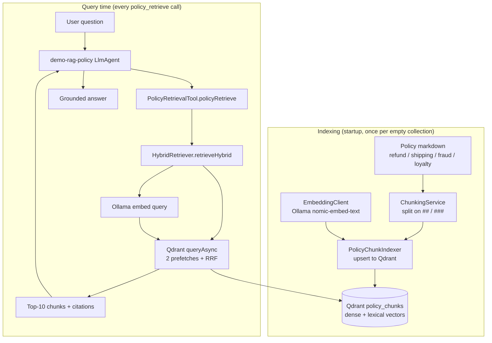

# RAG & Qdrant — How retrieval works in this POC

This document explains how **Retrieval-Augmented Generation (RAG)** is implemented in the Northwind customer-support assistant: where policy knowledge lives, how it is chunked and indexed into **Qdrant**, how the **Qdrant Java client** is used, and why we search with **hybrid retrieval** (semantic dense + BM25 lexical + RRF) instead of a single retriever.

**Related docs**

| Document | Role |
| :--- | :--- |
| [playbook.md §7](playbook.md#7-rag-policy-qa--demo-rag-policy) | Manual agent scenarios (`demo-rag-policy`) |
| [spec.md § RAG Indexing](spec.md#rag-indexing) | Contracts and fixture requirements |
| [architecture.md §4.2–4.3](architecture.md#42-qdrant-collections) | Collection schema and hybrid design notes |

---

## 1. What problem RAG solves here

Northwind policy knowledge (refunds, shipping, fraud, loyalty) lives in **four Markdown files** under `src/main/resources/policies/`. It is **not** in H2. The `demo-rag-policy` agent must:

1. **Retrieve** the right policy chunks for a user question.
2. **Ground** the LLM answer in those chunks (not invent policy).
3. **Cite** the source file and section (`Source: refund-policy.md — Refund request window`).

Vector search in **Qdrant** is the retrieval engine. The chat LLM (`qwen2.5:7b` via Ollama by default) only sees whatever chunks the retriever returns.

In this POC, the same Qdrant collection (`policy_chunks`) is also the **semantic memory** store — policy facts and business rules — distinct from **long-term memory** (customer preferences in H2, Playbook §8).

---

## 2. End-to-end flow



**Indexing** runs when the Spring app starts (`PolicyChunkIndexer` implements `ApplicationRunner`). If `policy_chunks` already has points, indexing is skipped.

**Retrieval** runs on every `policy_retrieve` tool call. Production code always uses **hybrid** search (`retrieveHybrid`). Dense-only exists for tests (`retrieveDenseOnly`).

---

## 3. Source documents

| File | Topics |
| :--- | :--- |
| `refund-policy.md` | Refund window (30 days), eligibility, late-delivery refunds |
| `shipping-policy.md` | Transit times, weather delays, late-delivery compensation |
| `fraud-policy.md` | Chargebacks, address risk, account takeover |
| `loyalty-policy.md` | Tier benefits, points, **courtesy exception codes** |

Files are authored with `##` / `###` headings so chunk boundaries align with **citable sections**. The hybrid-search trap (Playbook §7.3) is intentional:

- Tokens `NW-SHIP-EXC-04` and `NW-HP-1001` appear **only** in `loyalty-policy.md`.
- `shipping-policy.md` discusses weather-hold / exception-code concepts in prose **without** those exact tokens — a **dense-search distractor**.

---

## 4. Chunking

**Class:** `com.poc.adk.rag.ChunkingService`

Chunking turns each policy file into a list of `PolicyChunk` records before indexing.

### Algorithm

1. **Split on Markdown headings** — `##` and `###` lines become section boundaries. The document title (`# ...`) is skipped.
2. **Cap section size** — if a section body exceeds **~1,500 characters (~400 tokens)**, split further on paragraphs, then sentences, then hard character splits.
3. **Overlap on size-splits only** — when a section is split because it is too large, the last **~200 characters (~50 tokens)** of the previous piece are prepended to the next piece so boundary sentences are not lost.
4. **Metadata per chunk** — `doc_id`, `source_path`, `section_heading`, `chunk_index`, `text`.

### Why header-aware chunking

| Approach | Problem for this POC |
| :--- | :--- |
| One chunk per file | Citations are vague; multi-document questions need two whole files in context |
| Fixed token windows | Splits mid-section; citations degrade to “chunk 3” |
| Embedding-based chunking | Extra model and tuning for four short files we control |

Header-aware chunking keeps **one section heading per chunk** (when the section fits), which maps cleanly to citation strings.

---

## 5. Embeddings (dense / semantic side)

**Class:** `com.poc.adk.rag.EmbeddingClient`

Dense vectors power **semantic** (meaning-based) search. They are **not** routed through the ADK chat LLM.

| Setting | Value (`application.yml`) |
| :--- | :--- |
| Provider | Ollama `POST /api/embed` |
| Model | `nomic-embed-text` |
| Dimension | **768** (validated on every call) |

At **index time**, each chunk’s `text` is embedded and stored under the named vector `dense`.

At **query time**, the user’s question is embedded the same way and passed to Qdrant as a nearest-neighbor query on `using: dense`.

**Semantic search is good at:** paraphrases — e.g. *“How long can I send this back?”* → refund window section, even when the words *refund* or *30 days* are absent from the query.

**Semantic search is weak at:** rare exact tokens — SKUs, exception codes, ticket IDs — when another document uses similar *language* without the same tokens.

---

## 6. Qdrant setup and the Java client

### Infrastructure

| Component | Detail |
| :--- | :--- |
| Server | Qdrant **v1.15.3** in Docker (`docker compose up -d`) |
| REST / dashboard | `http://localhost:6333` |
| gRPC (Java client) | `localhost:6334` |
| Maven dependency | `io.qdrant:client:1.15.0` |

### Spring wiring

**Class:** `com.poc.adk.config.QdrantConfig`

On context refresh:

1. Builds a `QdrantClient` over **gRPC** (`QdrantGrpcClient`).
2. Calls `ensureCollection()` — creates `policy_chunks` if missing (idempotent).
3. Registers beans: `EmbeddingClient`, `ChunkingService`, `HybridRetriever`, `PolicyChunkIndexer`, `PolicyRetrievalTool`.
4. Initializes `VectorContext` (static bridge for non-Spring callers).

Configuration properties (`qdrant.host`, `qdrant.port`, `embedding.*`) come from `application.yml`.

### Collection schema: `policy_chunks`

One collection holds every policy chunk. Each point has **two named vector representations** plus payload metadata.

| Named vector | Type | Config | Produced by |
| :--- | :--- | :--- | :--- |
| `dense` | Dense 768-d | Cosine distance | `EmbeddingClient` → Ollama |
| `lexical` | Sparse (BM25) | `modifier: idf` | Qdrant inference `model: qdrant/bm25` |

**Payload fields** (used for citations and debugging):

| Field | Example | Purpose |
| :--- | :--- | :--- |
| `doc_id` | `refund-policy` | Stable document id |
| `source_path` | `refund-policy.md` | Citation file name |
| `section_heading` | `Refund request window` | Citation section |
| `chunk_index` | `0` | Order within document |
| `chunk_text` | Full chunk body | Injected into agent context |

```java
// QdrantConfig.collectionSpec() — simplified
CreateCollection.newBuilder()
    .setCollectionName("policy_chunks")
    .setVectorsConfig(/* dense: 768, Cosine */)
    .setSparseVectorsConfig(/* lexical: Modifier.Idf */)
```

There is **no** second Qdrant collection for semantic memory. Long-term customer preferences stay in H2.

---

## 7. Indexing into Qdrant

**Class:** `com.poc.adk.rag.PolicyChunkIndexer`

For each `PolicyChunk`:

1. **Dense vector** — `embeddings.embed(chunk.text())` → stored as `dense`.
2. **Lexical vector** — raw text sent to Qdrant as an inference `Document` with `model: "qdrant/bm25"` → stored as `lexical`. **No Java tokenizer**; Qdrant tokenizes server-side.
3. **Payload** — metadata + `chunk_text`.
4. **Upsert** — `qdrant.upsertAsync("policy_chunks", points)`.

```java
// PolicyChunkIndexer.toPoint() — both vectors on one point
namedVectors(Map.of(
    "dense", vector(denseFloats),
    "lexical", vector(Document.newBuilder()
        .setModel("qdrant/bm25")
        .setText(chunk.text())
        .build())
))
```

**Important:** `PolicyChunkIndexer` only writes to Qdrant. It never inserts Northwind domain rows into H2.

---

## 8. Search modes — from semantic to lexical to hybrid

Understanding retrieval as three **modes** clarifies why hybrid exists. All three query the same `policy_chunks` collection; they differ in **which vector** they use and whether results are **fused**.

### 8.1 Semantic (dense) search

**What it does:** Embed the query with Ollama → nearest-neighbor search on `using: dense` → ranked by cosine similarity.

**Qdrant API shape (conceptual):**

```http
POST /collections/policy_chunks/points/query
{
  "query": [0.01, 0.45, ...],   // 768-d embedding
  "using": "dense",
  "limit": 10,
  "with_payload": true
}
```

**In code:** `HybridRetriever.retrieveDenseOnly()` (tests only; not used in production).

| Strength | Weakness |
| :--- | :--- |
| Paraphrases and intent | Rare exact codes when another doc has similar *topic* language |

**Playbook example (§7.1):** *“How many days do I have to request a refund?”* → `refund-policy.md`. Dense alone is enough.

---

### 8.2 Lexical (BM25 / sparse) search

**What it does:** Send query **text** to Qdrant with `model: qdrant/bm25` → sparse vector match on `using: lexical` → ranked by BM25 with collection-level IDF.

**Qdrant API shape (conceptual):**

```http
POST /collections/policy_chunks/points/query
{
  "query": {
    "text": "Does exception code NW-SHIP-EXC-04 apply to SKU NW-HP-1001?",
    "model": "qdrant/bm25"
  },
  "using": "lexical",
  "limit": 10,
  "with_payload": true
}
```

**Qdrant support:** BM25 inference is **built into Qdrant ≥ 1.15.2** ([BM25 inference docs](https://qdrant.tech/documentation/inference/inference-bm25/)). You configure a **sparse vector** with `modifier: idf`; at index and query time you pass raw text — Qdrant builds the sparse vector.

| Strength | Weakness |
| :--- | :--- |
| Exact tokens, SKUs, codes | Paraphrases with no token overlap |

**Playbook example (§7.3):** Same exception-code query → `loyalty-policy.md` (only place those tokens exist).

**Not a payload full-text filter:** Qdrant payload indexes can **filter** but do not produce a ranked relevance score, so they cannot participate in RRF fusion. Lexical retrieval must be a **named sparse vector**.

---

### 8.3 Hybrid search (dense + BM25 + RRF)

**What it does:** Run **both** retrievers as **prefetches**, then **fuse** their ranked lists with **Reciprocal Rank Fusion (RRF)** in a **single** `queryAsync` call.

**What hybrid is *not*:**

- Not “the agent read two documents.”
- Not two semantic embedding models.
- Not a weighted sum of cosine score + BM25 score (those scales are incompatible).

**Qdrant API shape (conceptual):**

```http
POST /collections/policy_chunks/points/query
{
  "prefetch": [
    { "query": [0.01, ...], "using": "dense", "limit": 20 },
  {
      "query": { "text": "...", "model": "qdrant/bm25" },
      "using": "lexical",
      "limit": 20
    }
  ],
  "query": { "fusion": "rrf" },
  "limit": 10,
  "with_payload": true
}
```

**Qdrant support:** The [Query API](https://qdrant.tech/documentation/search/hybrid-queries/) (v1.10+) supports `prefetch` + `fusion: rrf` (or `dbsf`). Hybrid is **not** automatic — you must define named vectors, index both representations, and send this query shape. Our app does exactly that in `HybridRetriever.retrieveHybrid()`.

**In production:** `PolicyRetrievalTool` always calls `retrieveHybrid()`.

#### How RRF works (intuition)

Each prefetch returns an ordered list. RRF scores a document by **rank position** in each list, not by raw similarity magnitudes:

```
score(d) = sum over each list r that contains d of:  1 / (k + rank_r(d))
```

- `d` — a chunk (document) appearing in one or both ranked lists
- `r` — a retriever’s ranked list (dense or BM25)
- `rank_r(d)` — position of `d` in list `r` (1 = top result)
- `k` — smoothing constant (Qdrant’s default; avoids over-weighting rank #1)

A chunk that ranks #1 on BM25 but #8 on dense can still outrank a chunk that is #1 on dense only — which is exactly what we need when dense is fooled by the shipping-policy distractor and BM25 finds the loyalty codes.

Our Java client uses `fusion(Fusion.RRF)` with Qdrant’s default RRF parameters. After fusion, `HybridRetriever` applies a small **tie-break**: if scores are equal and the query contains identifier-like tokens (`NW-SHIP-EXC-04`), chunks containing more of those tokens sort higher.

#### Side-by-side: the Playbook §7.3 trap

Query: *“Does exception code NW-SHIP-EXC-04 apply to SKU NW-HP-1001?”*

| Mode | Typical top-1 | Why |
| :--- | :--- | :--- |
| **Dense** | `shipping-policy.md` | Semantically similar weather/exception language |
| **BM25** | `loyalty-policy.md` | Exact token match on the codes |
| **Hybrid (RRF)** | `loyalty-policy.md` | BM25 rank pulls loyalty up; RRF beats dense-only |

This is asserted without any LLM in `RetrievalEvalTest`.

---

## 9. Use cases — when each mode wins

The Playbook §7 scenarios map to retrieval behavior as follows.

| Playbook step | Query (summary) | Best mode | What to verify |
| :--- | :--- | :--- | :--- |
| **§7.1** | Refund window / days to request refund | Dense or hybrid | Top chunk from `refund-policy.md`; citation includes section |
| **§7.2** | Late delivery **and** refund | Hybrid (multi-chunk) | Top-**k** includes **both** `shipping-policy.md` and `refund-policy.md` — not a hybrid-*trap* case |
| **§7.3** | Exception code + SKU | **Hybrid required** | Top-1 is `loyalty-policy.md`, not shipping distractor |
| **§7.4** | Interstellar shipping (not in corpus) | N/A at retrieval layer | Qdrant still returns nearest neighbors; **agent** must say “not covered” |

### Evolution narrative (why we landed on hybrid)

```
Paraphrase questions          Identifier / code questions
        │                                │
        ▼                                ▼
   Dense works well                 BM25 works well
        │                                │
        └────────────┬───────────────────┘
                     ▼
              Hybrid (RRF)
         keeps dense wins + fixes dense misses
```

Support policy Q&A needs **both** paraphrase understanding and exact-code lookup. A single retriever optimizes one at the expense of the other. Hybrid is the minimal way to combine them without training a custom ranker.

---

## 10. Agent integration — from chunks to citations

### PolicyRetrievalTool

**Class:** `com.poc.adk.tools.PolicyRetrievalTool`

ADK function tool `policy_retrieve`:

1. Calls `HybridRetriever.retrieveHybrid(query)`.
2. Maps each `RetrievedChunk` to a JSON row: `source_path`, `section_heading`, `text`, `citation`, `score`.
3. Returns `{ "query": "...", "chunks": [ ... ] }` to the LLM.

Citation format (`CitationFormatter`):

```
Source: {source_path} — {section_heading}
```

### demo-rag-policy agent

**Class:** `com.poc.adk.agents.rag.RagPolicyAgent`

- Registers `policyRetrieve` as a `FunctionTool`.
- Instruction prompt (`prompts/demo-rag-policy.v1.md`) requires grounding and citation format.
- Temperature **0** for deterministic evals.

The LLM never talks to Qdrant directly — only through the tool.

---

## 11. Key classes (quick reference)

| Class | Package | Responsibility |
| :--- | :--- | :--- |
| `ChunkingService` | `rag` | Markdown → `PolicyChunk` list |
| `EmbeddingClient` | `rag` | Ollama dense embeddings |
| `PolicyChunkIndexer` | `rag` | Classpath policies → Qdrant upsert |
| `HybridRetriever` | `rag` | Dense, BM25, and hybrid `queryAsync` |
| `PolicyRetrievalTool` | `tools` | ADK tool wrapping hybrid retrieval |
| `QdrantConfig` | `config` | Client bean, collection bootstrap, RAG wiring |
| `RagPolicyAgent` | `agents.rag` | Playbook §7 demo agent |

---

## 12. Verification

### Automated (no chat LLM)

```bash
# Layer 1 — chunking + hybrid vs dense ranking
mvn test -Dtest=RetrievalEvalTest
```

`RetrievalEvalTest` recreates `policy_chunks`, re-indexes, and asserts hybrid top-1 is loyalty while dense top-1 is not.

### Manual — agent (Playbook §7)

1. `mvn compile exec:java`
2. Open ADK Dev UI → `demo-rag-policy`
3. Run the four Playbook §7 queries; step 3 must cite **loyalty-policy.md**.

---

## 13. What Qdrant provides vs what we implement

| Capability | Provided by | Our responsibility |
| :--- | :--- | :--- |
| Vector storage & HNSW search | Qdrant | Create collection, upsert points |
| Named dense + sparse vectors per point | Qdrant | Define `dense` + `lexical` in schema |
| BM25 tokenization & sparse vectors | Qdrant (`qdrant/bm25`) | Pass raw text at index/query time |
| Query API with `prefetch` + RRF | Qdrant | Build `QueryPoints` in `HybridRetriever` |
| Dense embeddings | Ollama (`nomic-embed-text`) | `EmbeddingClient` |
| Chunking & citations | This app | `ChunkingService`, payload metadata |
| Grounded answers | ADK agent + prompt | `PolicyRetrievalTool`, `demo-rag-policy` |

Hybrid search is **supported out of the box by Qdrant** once the collection and query are configured. It is **not** a single toggle — you still choose models, vector names, prefetch limits, and fusion method.

---

## 14. Troubleshooting

| Symptom | Likely cause | Fix |
| :--- | :--- | :--- |
| `points_count` is 0 | Index never ran | Start app once with Qdrant up |
| Dense/hybrid fails on embed | Ollama not running or model missing | `ollama pull nomic-embed-text` |
| BM25 / hybrid lexical fails | Qdrant too old | Use `docker compose` image **v1.15.3** |
| Hybrid top-1 is shipping on §7.3 | Dense-only path or weak distractor | Run `RetrievalEvalTest`; check `retrieveHybrid` is used |
| Agent cites wrong doc but retrieval test passes | LLM ignored tool output | Prompt / Playbook agent check, not indexer |

---

## 15. Further reading

- [Qdrant hybrid queries](https://qdrant.tech/documentation/search/hybrid-queries/) — prefetch, RRF, DBSF
- [Qdrant BM25 inference](https://qdrant.tech/documentation/inference/inference-bm25/) — server-side sparse vectors
- [Qdrant Java client](https://github.com/qdrant/java-client) — `QdrantClient`, `queryAsync`
